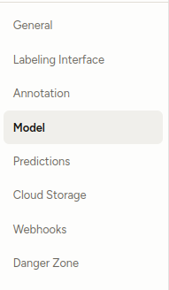
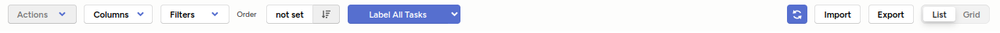

# Video Studio

This project enables tracking and segmentation of video objects using a combination of [Label Studio ML Backend](https://github.com/heartexlabs/label-studio-ml-backend) and [Segment Anything 2](https://github.com/facebookresearch/segment-anything).

## Table of Contents
1. [Requirements](#requirements)
2. [Installation](#installation)
3. [Usage](#usage)
4. [Contributing](#contributing)

---

## Requirements

### Project Requirements
- Program: see the two repos 
  - `label-studio-ml-backend/label_studio_ml/examples/segment_anything_2_video`
  - `segment-anything-2`
- README.md (you are reading it :) )
- Documentation can be found here: [model.py](my-docs/docs/auto-docs/model.html), [test_api.py](label-studio-ml-backend/label_studio_ml/examples/segment_anything_2_video/test_api.py)
- [Testing outline document](testing-plan.md): testing-plan.md
- [Test script](.github/workflows/python-app.yml): .github/workflows/python-app.yml
- Deliverables: While I was not able to completely implement two object tracking, I was able to get single object tracking and found some bugs in the existing codebase that I fixed!
- Please see the assets folder for the presentation and other diagrams

### System Requirements
- **Python**: Version 3.10 or higher
- **CUDA Drivers**: Ensure CUDA drivers are installed and `nvidia-smi` is available.
- **Git**: Ensure `git` is installed for managing submodules.

### Library Dependencies
- Python libraries listed in:
  - `requirements.txt`
  - `label-studio-ml-backend/requirements.txt`
  - `label-studio-ml-backend/label_studio_ml/examples/segment_anything_2_video/requirements.txt`
  - `label-studio-ml-backend/label_studio_ml/examples/segment_anything_2_video/requirements-test.txt`
- Dependencies from the `segment-anything-2` repository.

- (TODO) for a comprehensive list of all of the requirements see here: [full-requirements.md](full-requirements.md)
---

## Installation

### Step 1: Clone the Repository with Submodules
```bash
git clone --recurse-submodules <repository-url>
```

If you've already cloned the repository, initialize and update the submodules:

```bash
git submodule init
git submodule update
```
### Step 2: Run the Setup Script

Execute the setup.sh script to install all required dependencies:
```bash
bash setup.sh
```
This script will:

1. Source environment variables from source-file.sh.
2. Check for CUDA drivers.
3. Set up a virtual environment and install dependencies for:
    - label-studio-ml-backend
    - segment-anything-2
4. Download necessary model checkpoints.

### Step 3: Change the following environment variables in the source-file.sh script 
fill them in with your credentials:
- LABEL_STUDIO_URL: the http:// or https:// link to your label studio instance (include the prefix!) 
- LABEL_STUDIO_API_KEY: your api key for label studio, available in your profile.

### Step 4. Source your setup file
Load the environmental variables into your system
```bash
source ./source-file.sh
```

## Usage

### Step 1. Source your setup file
Load the environmental variables into your system
```bash
source ./source-file.sh
```

### Step 2: Start the Label Studio ML Backend

Navigate to the `label_studio_ml/examples/segment_anything_2_video` directory:
```bash
cd label_studio_ml/examples/segment_anything_2_video
```
Run the ML backend with the following command:
```bash
label-studio-ml start ./segment_anything_2_video
```
This will start the server required for running the ML-backed video segmentation tasks.

### Step 3: Interact with Label Studio
- Start label studio with `label-studio start` command in another terminal
- open label studio at [local host](http://localhost:8080)
- log in or create a new account
### Step 4: Configure you project (TODO automatic configuration with the label studio python sdk)

- Your labeling config needs to be configures as mentiond here: [label-config-sam2-video](label-studio-ml-backend/label_studio_ml/examples/segment_anything_2_video/README.md)
- Connect the ML backend using the appropriate API endpoint. You can copy this from your settings in the upper right corner of Label Studio at [local host](http://localhost:8080)
- In you project settings go to the Model tag:

    
- When configuring the model backend ensure your url is the following: 
  ```
  http://localhost:9090
  ```
  unless you specificed otherwise

### Step 5: Add some videos to your project
Click the import button and add some videos to you project'


### Step 6: Label some videos!